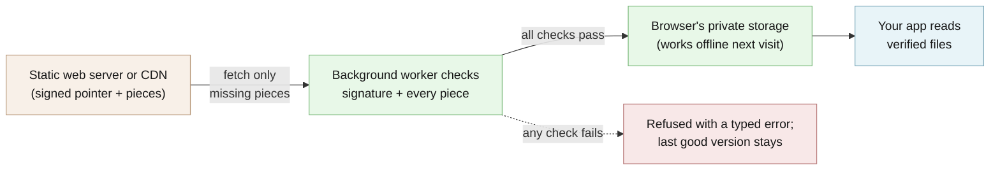

# @edgeproc/browser

For web developers: load data into a browser tab only if it's provably yours and unaltered, then keep using it offline.

[](https://github.com/hseshadr/edgeproc-browser/actions/workflows/ci.yml)
[](LICENSE)

[Docs](#usage--api) · [Quickstart](#try-it-in-60-seconds)

```text
input:  a real signed bundle from this repo (783 pieces), loaded twice: once exactly as
        published, once with one byte flipped in each downloaded piece
output: accepted: version v1, 783 pieces, every one checked
        refused:  IntegrityError: chunk 8645849f545dd85f77fd2ad8d42a9e07d9d4809a041d354899df160c11e55fbe failed to decompress
```
<sub>Real output of the example below.</sub>

## At a glance

- **What it does** — Like the padlock-and-checksum habit of a careful software download, but
  built into your web page: before your app uses a data file it downloaded (a product
  catalog, a search index, a price list), the page checks it was signed by you and that not
  one byte changed on the way. Anything that fails the check is refused, never "used with a
  warning". It keeps the checked copy in the browser so the next visit works offline, and it
  lets you watch every network request the background download makes.
- **Who it's for** — A web developer shipping data to users' browsers who wants the page,
  not the server or the CDN, to be the judge of whether that data is genuine. For example, a
  shop that runs product search inside the tab and needs to know the catalog wasn't swapped
  on a mirror, and to prove the page then stopped calling a backend.
- **What stays on your device / what leaves it** — Stays: every downloaded file, the checked
  copy (kept in the browser's private per-site storage), and any app state you save with
  the optional state store. The library has no server, no analytics, and no account.
  Leaves: only the download requests your app configures — to the bundle address and the
  public-key address you pass in, when `sync` runs. The optional network monitor reports
  those requests to your own page and nowhere else.
- **Runs on** — Modern browsers with Web Workers; tested in CI in Chromium. Uses the
  browser's private file storage (OPFS) and falls back to the browser's older built-in database (IndexedDB) where that is missing.
  The checking core also runs in Node 22.13 or newer.
- **Not for** — Two-way sync of user edits back to a server (data flows one way, publisher to
  browser). Not a drop-in app: it gets verified bytes into the tab and knows nothing about
  what they mean.
- **Status** — Beta: 0.1.0 is planned but not yet tagged or published to npm; install from an
  exact Git commit today. See [CHANGELOG](CHANGELOG.md).

## Try it in 60 seconds

Needs Node 22.13+ with corepack (bundled with Node):

```bash
git clone https://github.com/hseshadr/edgeproc-browser && cd edgeproc-browser && corepack enable && pnpm install --frozen-lockfile
```

Save this as `try.mjs` inside the clone and run `node try.mjs`:

```js
import { readFileSync } from "node:fs";
import { MemoryCacheStore, syncIndex, verifyEd25519 } from "./dist/index.js";

const dir = "src/engine/__fixtures__/bundle"; // a real signed bundle shipped in this repo
const read = (path) => new Uint8Array(readFileSync(`${dir}/${path}`));
const key = read("keys/public.key"); // the only thing trusted: not the server, not the network
const verify = (message, signature) => verifyEd25519(key, message, signature);
const server = async (url) => read(url.replace("/cat/", "catalog/")); // stands in for a web server
const tampered = async (url) => { const b = await server(url); if (url.includes("/chunk/")) b[9] ^= 1; return b; };

const ok = await syncIndex({ baseUrl: "/cat", store: new MemoryCacheStore(), fetchBytes: server, verify });
console.log(`accepted: version ${ok.version}, ${ok.chunksFetched} pieces, every one checked`);
await syncIndex({ baseUrl: "/cat", store: new MemoryCacheStore(), fetchBytes: tampered, verify })
  .catch((error) => console.log(`refused:  ${error.constructor.name}: ${error.message}`));
```

```text
accepted: version v1, 783 pieces, every one checked
refused:  IntegrityError: chunk 8645849f545dd85f77fd2ad8d42a9e07d9d4809a041d354899df160c11e55fbe failed to decompress
```

What happened: the first load checked the publisher's signature and all 783 pieces, then
accepted them. The second load served the same bundle with one byte changed per piece; the
first bad piece stopped the whole load with an error instead of handing back damaged data.
The "server" is a function reading local files, so no network was used. The built `dist/` is
committed, so no build step is needed.

More runnable examples: [`examples/`](examples/) — `pnpm demo` runs the longer
[`quickstart.mjs`](examples/quickstart.mjs) (output under [Usage & API](#usage--api)).

<!-- ======================== BELOW THE FOLD ======================== -->

## How it works

A publisher (for example the Python `edge-proc` CLI) cuts files into pieces, names each piece
by a fingerprint of its contents, and signs one small "pointer" that vouches for the list of
pieces. Your page hands the bundle address and the public-key address to a Web Worker (a
background thread), which fetches the pointer, checks its signature against the pinned key,
then fetches only the pieces it doesn't already have and checks each one against its
fingerprint. Only after everything checks out does the new version replace the old one in the
browser's storage; any failure is a typed error and the previous good version stays. A small
monitor inside the Worker reports every request it made back to the page, so "no backend
calls" can be counted rather than promised.



**[Explore the interactive architecture map →](docs/architecture/index.html)**
(Archify, generated from [`docs/architecture/runtime.architecture.json`](docs/architecture/runtime.architecture.json)).
Deep dive: [the state-store contract](docs/sqlite-state.md) and
[dependency notes](docs/dependencies.md).

### The problem, in one line

You want to ship data to a browser and have the tab verify it rather than trust the server — and you want to be able to *prove* the tab then stopped talking to the network.

Both halves are harder than they look. The first is a pile of fiddly, security-critical plumbing (canonical bytes, monotonic version pointers, decompression bombs, partial writes) that every local-first app rewrites badly. The second is a trap: **every browsing context keeps its own resource-timing timeline**, so a `PerformanceObserver` on the window sees *nothing* a Worker fetches. A "0 backend calls" counter built the obvious way reads zero exactly when it matters.

In the technical terms: fetch under a byte cap. Verify an ed25519 signature over canonical JSON. Bound and verify every zstd decompression. Store chunks content-addressed in OPFS. Reassemble files. Do all of it in a Web Worker, and — this is the part nobody else does — let the main thread *observe that Worker's network activity*, so "no backend calls" is a measurement instead of a promise.

Zero framework dependencies. Three small runtime deps (`@noble/ed25519`,
`@hpcc-js/wasm-zstd`, and `idb-keyval`), plus one opt-in, self-hosted SQLite
runtime shared by the separate `@edgeproc/browser/sqlite` application-state and
`@edgeproc/browser/vector/sqlite` vector exports.

## What you can do

- Verify every downloaded byte before use, including bounded zstd expansion — [fail-closed table](#the-invariant-fail-closed)
- Cache content-addressed chunks locally and reject rollback or equivocation — [trust root](#the-trust-root-one-key-or-a-keyring)
- Rotate signing keys with a keyring, revoke a key, and expire stale pointers — [SECURITY.md](SECURITY.md)
- Observe Worker network activity from the context where it actually happens — [network sentinel](#counting-what-the-worker-fetched)
- Search by meaning with an exact vector index, in memory or persisted in SQLite — [vector search](#semantic-similarity-without-faiss)
- Keep portable application state in one real SQLite file, with atomic CAS
  writes and validated backup replacement instead of raw SQL — [state-store contract](docs/sqlite-state.md)

## Why this and not X

| Alternative | Where it is the better choice | What this adds |
| --- | --- | --- |
| Plain `fetch` over HTTPS | You fully trust the server and every CDN in between | The tab checks a signature from a key you pin, so a swapped file on a mirror is refused |
| Subresource Integrity (`integrity=` on a script tag) | A few files whose hashes you can bake into the HTML at build time | Data that changes without redeploying the page: one signed pointer covers every piece, plus rollback refusal |
| A service-worker cache (for example Workbox) | Caching your app's own code and pages for offline use | Signature and per-piece checks on the data, delta downloads, and a count of what the Worker fetched |
| A hosted database with sync | Users edit shared data that must flow back to a server | No backend at all after delivery; nothing about the user leaves the tab |
| The Python `edge-proc` library | Devices that run Python rather than a browser | The same signed-bundle format, checked in the browser |

## Security and trust model

- **Verified:** the signed pointer (Ed25519, against a pinned public key or keyring fetched
  without HTTP caching), the file list it names, every piece against its SHA-256 address,
  every decompressed size against its signed size, and every reassembled file.
- **Refuses rather than warns:** a bad signature, a revoked or unknown signer, a tampered
  piece, an oversized response, a rolled-back or forked pointer, or a pointer past its signed
  expiry each throws a typed error; nothing unverified is returned. Only a genuine network
  outage may serve the cached copy — see the [fail-closed table](#the-invariant-fail-closed).
- **Not protected:** a compromised page or browser extension (it runs with your page's
  rights), an attacker who controls the public-key address itself (serve it over HTTPS,
  separately from the bundle), a stolen signing key before you revoke it, and what your app
  does with the data after it is verified.
- **Verify a release:** there is no npm release yet. Install from an exact Git commit; the
  gate rebuilds `dist/` and refuses if it differs from the committed output
  (`pnpm verify:dist`). Future npm releases publish from CI with provenance
  (`npm audit signatures` checks it); the first bootstrap publish may not carry it — see the
  [CHANGELOG](CHANGELOG.md).

See [SECURITY.md](SECURITY.md) for the full threat model and for reporting a vulnerability.

### The invariant: fail closed

An unverifiable byte is not a degraded byte, it is a rejected one. Every path that cannot prove integrity throws rather than returning something a caller might use:

| Failure | Error |
|---|---|
| signature does not verify | `SignatureError` |
| pointer names a revoked / unlisted signer | `KeyRevokedError` / `UnknownKeyError` (both `SignatureError`) |
| trust root is malformed | `KeyringError` (an `IntegrityError`) |
| network pointer is past its signed `expires_at` | `PointerExpiredError` (an `IntegrityError`) |
| chunk hash ≠ content address | `IntegrityError` |
| decompressed size ≠ signed size | `IntegrityError` |
| response past its byte cap | `ResponseTooLargeError` (an `IntegrityError`, deliberately — sync must never fall back to cache for it) |
| pointer sequence went backwards, or forked at equal sequence | `RollbackError` |
| bundle exceeds a structural cap | `SyncCapError` |
| Worker died before replying | `WorkerCrashError` |
| Worker went silent | `WorkerTimeoutError` |
| Worker operation failed | `EngineOperationError` with `integrity`, `rollback`, `network`, `storage`, or `internal` code |

A network outage is the *only* condition that may serve cache, and it is a distinct type (`NetworkError`) for exactly that reason. The Worker boundary reports every keyring and expiry failure with the existing `integrity` code.

## What this proves / what it does not prove

| Claim | Evidence |
| --- | --- |
| A tampered piece or wrong key is refused | The example above; `pnpm demo` step 4 (one bit flipped in the key → `SignatureError`); the unit suite under `src/` |
| A second sync over a primed store downloads nothing | `pnpm demo` step 3 (`chunks fetched 0 (reused 783)`) |
| The built Worker enforces raw-key, keyring, and revoked-signer trust roots | `pnpm test:browser` — `test/browser/engine-keyring.spec.ts` in real Chromium |
| SQLite state and vectors persist in OPFS across restarts with zero external requests | `pnpm test:browser` — `test/browser/sqlite-vector.spec.ts` |
| The published `dist/` matches the source | `pnpm verify:dist` plus `test/dist-contract.test.ts`, both in `pnpm gate` |
| A Vite app emits exactly one engine Worker | `test/vite-consumer.test.ts` |

**Not proven here:** browsers other than Chromium (CI runs Chromium only); real OPFS
locking under jsdom (see Known gaps below); behavior on a compromised device.

### Known gaps

Stated plainly, because an unstated gap is a lie by omission:

- **`opfsStore.ts` is excluded from the numeric jsdom coverage gate.** Its
  in-memory OPFS double covers dual-slot promotion, zero-byte cleanup,
  corruption recovery, and pre-write handle contention; real sync-access-handle
  behavior is exercised in the Chromium tier.
- **`worker.ts` is excluded too**, for a different reason: it is a top-level side effect, so importing it under jsdom would run it, not test it. `test/browser/engine-keyring.spec.ts` drives the built Worker in real Chromium through the raw-key, keyring, and revoked-signer trust roots.
- **The SQLite Workers are excluded from jsdom coverage for the same reason.**
  Real Chromium opens OPFS, verifies vector extension provenance and restart
  persistence, then exercises application-state export/import, simultaneous
  Worker visibility, a competing CAS write, reload persistence, and zero
  external requests.
- Everything counted clears the project floor: 93.65% statements, 87.84%
  branches, 97.03% functions, and 94.31% lines (400 tests at the keyring change).

## Install

`@edgeproc/browser` is not published to npm yet. Until the first release, install an exact
Git commit (npm, pnpm, and Bun all work):

```bash
pnpm add github:hseshadr/edgeproc-browser#<commit-sha>
```

Exact Git-SHA installs are supported before the npm bootstrap. Deterministic
`dist/` output is committed so clients such as Bun that do not run Git-package
lifecycle scripts still work; npm and pnpm also rebuild it through
`prepare: npm run build`. The gate refuses when a clean build differs from the
committed output, while registry tarballs continue to contain only `dist/`.

To hack on it, clone and install (Node >= 22.13; CI uses Node 24):

```bash
git clone https://github.com/hseshadr/edgeproc-browser && cd edgeproc-browser
corepack enable
pnpm install --frozen-lockfile
```

## Usage & API

### Run the full demo

A real signed bundle, verified end to end, with no network and no browser:

```bash
pnpm demo
```

```
1. syncing the signed bundle into a content-addressed store...
   version        v1
   manifest       81a71fb0ba2f01ed...
   chunks fetched 783, reused 0
   bytes fetched  2018076
   http requests  785

2. reassembling 728 files, each verified...
   all 728 files match their signed sha256.

3. a second sync over the primed store refetches nothing:
   chunks fetched 0 (reused 783)

4. fail-closed check — same bundle, one bit flipped in the key:
   rejected with SignatureError — fail-closed holds.
```

That is [`examples/quickstart.mjs`](./examples/quickstart.mjs), running against the real signed bundle committed in this repo. The transport is injected, so "no network" is structural rather than asserted.

### Sync in a Web Worker (Vite)

With Vite, keep the Worker entry in consumer source so the bundler owns its URL:

```ts
// src/edgeproc.worker.ts
import "@edgeproc/browser/worker";
```

```ts
// main thread
import { EngineClient } from "@edgeproc/browser";
import EdgeProcWorker from "./edgeproc.worker?worker";

const client = new EngineClient(new EdgeProcWorker(), { idleTimeoutMs: 60_000 });
const result = await client.sync(bundleBaseUrl, pubkeyUrl, {
  expectedBundleId: "my-bundle",
  expectedChannel: "stable",
  wantedPaths: ["catalog_meta.json", "images/"],
  onProgress: ({ phase }) => renderPhase(phase),
});

const bytes = await client.readFile("catalog_meta.json"); // verified or it throws
await client.clear(); // same cross-tab lock as sync/read
```

`wantedPaths: undefined` syncs every signed file. `wantedPaths: []` verifies and
promotes only the signed pointer and manifest, so an application can inspect a
catalog first and fetch a selected directory later. Every verified chunk emits
progress and re-arms the client's idle watchdog.

Chunk transport failures classified as `NetworkError` receive six bounded
attempts with exponential jitter (9 seconds maximum backoff). Integrity,
signature, storage, and rollback failures are verdicts and are never retried.

### The trust root: one key, or a keyring

`pubkeyUrl` is the trust root, fetched `no-store` and capped at 64 KiB. It is
auto-detected:

- **exactly 32 bytes** — a raw Ed25519 public key, exactly as before (a
  keyring of one);
- **anything else** — a strict JSON keyring:

```json
{
  "schema": "edgeproc.keyring/v1",
  "keys": [
    { "key_id": "34750f98bd59fcfc", "public_key": "8a88e3dd…6f5c" },
    { "key_id": "6a3803d5f059902a", "public_key": "8139770e…b394" }
  ],
  "revoked": []
}
```

`key_id` is the first 16 lowercase hex characters of sha256 of the raw 32-byte
public key (`deriveKeyId`), and must match its key. Unknown fields, duplicates,
and a ring with no unrevoked key are rejected (`KeyringError`).

A pointer may carry two optional signed fields. Both are left out of the
signed bytes when absent, so existing pointers verify unchanged:

- `key_id` — only that key may verify it. A revoked id fails with
  `KeyRevokedError`, an unlisted one with `UnknownKeyError`. Without `key_id`,
  any unrevoked key may verify; a revoked key never does.
- `expires_at` — Unix seconds. A pointer fetched from the network at or past
  its deadline fails with `PointerExpiredError`. **Offline**, an expired
  pointer whose bundle is already cached and verified is still served, with
  `expired: true` on the sync result, so an offline PWA keeps working and can
  tell the user the data may be stale.

To rotate, publish a keyring with both keys, sign the next pointer with the
new key at a higher `sequence`, then revoke the old key. The last promoted
pointer stays the rollback floor through all of it. See
[SECURITY.md](SECURITY.md) for the full policy.

Calling `syncIndex` directly, pass `keyring` (from `parseTrustRoot` or
`loadTrustRoot`) or a single `verify` function, not both. `now` injects the
expiry clock in Unix seconds.

### Counting what the Worker fetched

To count what a Worker actually fetched, listen on the sentinel channel:

```ts
import {
  NETWORK_SENTINEL_CHANNEL,
  isNetworkSentinelReport,
} from "@edgeproc/browser";

const channel = new BroadcastChannel(NETWORK_SENTINEL_CHANNEL);
channel.onmessage = (event) => {
  if (!isNetworkSentinelReport(event.data)) return; // same-origin != trusted
  // event.data.entries carry EPOCH timestamps, comparable across contexts
};
```

### Semantic similarity without FAISS

The vector API is an adapter seam, not a ranking framework. Use the tiny exact
in-memory adapter for bounded datasets, or opt into SQLite + OPFS when the index
must survive a reload:

```ts
import { createSqliteVectorIndex } from "@edgeproc/browser/vector/sqlite";

const index = await createSqliteVectorIndex({
  name: "my-catalog",
  dimension: 384,
});

await index.insert([{ id: "sku-1", vector: embedding, metadata: { tenant: "a" } }]);
const nearest = await index.search(query, 10, { tenant: "a" });
const candidates = await index.searchByIds(query, candidateIds); // one exact batch score
await index.deleteWhere({ tenant: "a" }); // requires a non-empty metadata scope
await index.clear(); // exact count returned; removes every local vector
await index.dispose();
```

This path uses SQLite 3.53.4 plus only the Apache-2.0 sqlite-vector 1.1.2
extension, statically linked into a 934,257-byte WASM file. It does **not** ship
FAISS, SQLiteAI sync/memory/network modules, an embedding model, or a backend.
Search is exact FLOAT32 cosine distance; filters are parameterized equality
predicates ANDed together. SQLite runs in a dedicated Worker and persistent mode
uses the OPFS SAH-pool VFS. One index is single-owner: concurrent tabs receive
an actionable open error after a bounded retry, rather than silently sharing a
synchronous access handle.

For ephemeral or small catalogs, import `FlatVectorIndex` from
`@edgeproc/browser/vector`; it has the same contract and no WASM startup cost.
For an immutable FLOAT32 matrix already authenticated by a signed bundle, use
the synchronous `PackedVectorIndex`: it copies and validates the matrix, computes
exact cosine similarity without another dependency, preserves producer order on
ties, and zeroizes its owned storage on disposal.
The build recipe, exact source pins, hashes, and licenses live beside the
packaged assets in [`src/vector/sqlite/assets/README.md`](src/vector/sqlite/assets/README.md).

For a Node recall or evaluation job that must use the same pinned SQLite and
sqlite-vector runtime—not a JavaScript cosine fallback—use the explicit
Node-only entrypoint. It is in-memory by design and never changes browser
bundle behavior:

```ts
import { createNodeSqliteVectorIndex } from "@edgeproc/browser/vector/sqlite/node";

const index = await createNodeSqliteVectorIndex({ name: "recall-eval", dimension: 384 });
// insert/search/searchByIds/deleteWhere/clear have the same VectorIndex contract.
await index.dispose();
```

### Portable application state without raw SQL

`@edgeproc/browser/sqlite` is a small application-state Lego over the same
pinned SQLite 3.53.4 Worker and OPFS runtime. Values are bytes, so the consumer
owns its JSON/MessagePack/Protobuf codec while this package owns durability,
transactions, schema epochs, and portable database files:

```ts
import { createSqliteStateStore } from "@edgeproc/browser/sqlite";

const state = await createSqliteStateStore({
  name: "my-app",
  initialSchemaVersion: 1,
});

const encoded = new TextEncoder().encode(JSON.stringify({ theme: "dark" }));
const write = await state.put("settings", "appearance", encoded);

// One transaction and one epoch for related changes. expectedEpoch is CAS:
// a stale writer fails with SqliteStateConflictError and writes nothing.
await state.batch(
  [
    { type: "put", namespace: "profiles", key: "primary", value: profileBytes },
    { type: "delete", namespace: "drafts", key: "profile" },
  ],
  { expectedEpoch: write.epoch },
);

const backup = await state.exportBytes(); // actual application/x-sqlite3 bytes
const staged = await state.stageImport(backup); // header, identity, schema, integrity
await state.commitImport(staged.stageId, {
  expectedEpoch: (await state.runtimeInfo()).epoch,
}); // one transaction replaces the state table

await state.dispose();
```

The public API has no `exec()` or query-string escape hatch. `get`, bounded
`list`, `put`, `delete`, `batch`, `migrate`, `reset`, integrity, export, and
staged import are the complete contract. An import never mutates live state
until commit; commit rechecks the epoch and replaces rows transactionally.

Persistent state uses SQLite 3.53.4's official `opfs-wl` VFS. Its SQLite file
locks are backed by browser Web Locks, so multiple tabs/Workers can safely open
the same store while SQLite serializes their transactions. The state Worker
also takes one store-scoped Web Lock before reading the CAS epoch and beginning
a mutation; without that outer lock, two SQLite connections can both validate
the same epoch before either commits. A tab writing from an old epoch gets
`SqliteStateConflictError` and must reload and deliberately reconcile. If
`opfs-wl` is unavailable, opening fails instead of silently downgrading to
unsafe shared ownership. Memory mode remains isolated per Worker. `opfs-wl`
requires a cross-origin-isolated page: serve COOP
`same-origin` and COEP `require-corp` (or a compatible `credentialless` policy),
then verify every cross-origin asset remains loadable. See
[the state-store contract](docs/sqlite-state.md) for migrations, backup
semantics, deployment headers, and ownership details.

### Consuming this package

It builds to ESM with fully-specified relative imports, so it works in Node and in every bundler. It is nonetheless **browser-only at runtime**: modules reference `BroadcastChannel`, `PerformanceObserver`, `navigator.storage`, and `WorkerGlobalScope`. Import it in bare Node and it will type-check and load, then fail the moment it touches a browser global. The exception is the pure-logic core (`crypto`, `canonical`, `integrity`, `zstd`, `sync` with `MemoryCacheStore`), which runs anywhere — that is what the quickstart exercises.

Persistent storage writes new content to OPFS and keeps only the small active
pointer rollback floor in IndexedDB. Reads can reuse verified legacy content
from either store without duplicating new payloads, and full IndexedDB storage
is used when OPFS is unavailable. Consumers with an existing cache can declare its
database, object-store, and `:` or `/` key separator through
`indexedDbLayout`, avoiding a duplicate migration layer. Names are bounded and
validated.

The root `EngineClient` export intentionally contains no Worker URL, so Vite
does not emit an unused duplicate Worker beside the consumer-owned entry shown
above. Direct, unbundled browser ESM deployments can opt into the separate
spawn helper:

```ts
import { spawnEngineClient } from "@edgeproc/browser/spawn";

const client = spawnEngineClient({ idleTimeoutMs: 60_000 });
```

`test/vite-consumer.test.ts` builds the recommended public API through Vite and
proves that exactly one engine Worker asset is emitted.

## Configuration

There are no environment variables or config files. Everything is an argument:

| Where | Option | What it changes |
| --- | --- | --- |
| `client.sync(baseUrl, pubkeyUrl, options)` | `baseUrl`, `pubkeyUrl` | The bundle origin and the trust root (raw key or keyring). |
| `client.sync` options | `expectedBundleId`, `expectedChannel` | Identity pins; `undefined` skips a pin, `null` requires the field to be absent. |
| `client.sync` options | `wantedPaths` | `undefined` = every file; `[]` = pointer and manifest only; paths or `dir/` prefixes = a subset. |
| `client.sync` options | `onProgress` | Called per phase and per verified chunk. |
| `new EngineClient(worker, options)` | `idleTimeoutMs` | How long a silent Worker may go before `WorkerTimeoutError`. |
| `syncIndex(...)` | `keyring` or `verify`, `now` | Trust root for direct use; `now` injects the expiry clock in Unix seconds. |
| Persistent store | `indexedDbLayout` | Reuse an existing IndexedDB database/store/key layout. |
| `createSqliteVectorIndex` / `createSqliteStateStore` | `name`, `dimension`, `initialSchemaVersion` | Which local database to open, and its shape. |

There are no secrets: the public key is public, and the private signing key belongs only to
the publisher.

## Limitations & roadmap

**Shipped:** nothing is in a tagged release yet. On `main` today: the verification core,
sync state machine, stores, Worker boundary, network sentinel, keyring trust root, vector
indexes, and the SQLite state store (see [CHANGELOG](CHANGELOG.md) `[Unreleased]`).

**Planned (not shipped):** the first npm release, 0.1.0 (see the CHANGELOG's "Planned
0.1.0" section, including its note that the bootstrap publish may lack npm provenance); a
real-browser tier that can carry a coverage number for `opfsStore.ts`.

### What is deliberately NOT here

This package is the substrate, not a product. It knows how to get bytes into a tab intact and nothing about what they mean. Kept out on purpose:

- **Domain ranking / recommendation.** The generic vector seam lives here;
  product features and ranking policy remain in
  [edge-reco](https://github.com/hseshadr/edge-reco).
- **Sanctions screening / name matching.** That is [aml-filter](https://github.com/hseshadr/aml-filter)'s, and it lives there.
- **The composition root.** Whatever wires this substrate to *your* domain is yours to own — that is the seam that keeps this package a dependency rather than a framework.
- **Embedding models.** `@huggingface/transformers` is a heavyweight, model-specific dependency; it does not belong in a package this low.

The rule: if a module needs to know what the bundle *contains*, it does not belong here.

## Getting help

- **GitHub Issues** — Best for: bugs and concrete feature requests.
- **Private advisory or email** — Best for: security reports; see [SECURITY.md](SECURITY.md).
  Never open a public issue for a vulnerability.

## Contributing / development

```bash
pnpm gate
```

That runs lint → typecheck → build → dist check → test, exactly what CI runs. CI also runs
the real-Chromium tier:

```bash
pnpm test:browser # real Chromium: sqlite-vector + Worker + OPFS reopen, and the
                  # built engine Worker under a raw key, a keyring, and a revoked signer
```

The build runs *before* the tests on purpose: `files: ["dist"]` means consumers get only build output, so the gate verifies the committed artifact is fresh and `test/dist-contract.test.ts` loads its public exports with native Node ESM. A claim that holds in `src/` and fails in `dist/` is invisible to every source-level test.

See [CONTRIBUTING.md](CONTRIBUTING.md).

## License / Citation

MIT — see [LICENSE](LICENSE).

**Provenance.** The original signed-bundle engine was extracted from
[edge-reco](https://github.com/hseshadr/edge-reco), where it had already run in
production. The shared package now also carries the consumer-independent
persistence, scoped-sync, progress, typed-error, and packed-vector contracts;
domain catalog selection and result-shape adapters remain in consumers.
