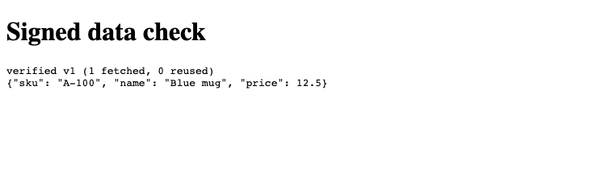
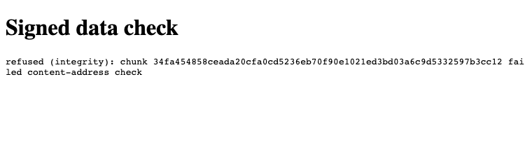

# @edgeproc/browser

For web developers: have the browser check that downloaded data was signed by you and not changed, then keep it for offline use.

**`npm install @edgeproc/browser`** (version 0.1.0 on npm)

[](https://github.com/hseshadr/edgeproc-browser/actions/workflows/ci.yml)
[](https://www.npmjs.com/package/@edgeproc/browser)
[](LICENSE)

Many web apps download data files and work with them inside the page: a product catalog, a
search index, a price list, a model. The page trusts whatever the server or CDN sends back.
If a mirror serves an old copy, or a file is changed or cut short on the way, the app uses it
anyway and nobody notices.

This package lets the page check the data itself. You sign the data once when you publish
it. The page downloads it in a background thread (a Web Worker), checks your signature and
every piece, and refuses anything that does not match. It keeps the checked copy in the
browser, so the next visit downloads only what changed and still works offline.
[AlmaMesh](https://github.com/hseshadr/almamesh) uses it to download its chart engine.

**Technical docs:** [Architecture](docs/ARCHITECTURE.md) · [API guide](docs/API.md) · [Getting started for developers](docs/GETTING_STARTED.md) · [Security](SECURITY.md)

## Try it

You need Node 22.13 or newer, and [uv](https://docs.astral.sh/uv/) to run the Python tool
that signs the data. This takes about a minute.

1. Make a project and install the package, plus Vite to serve the page:

   ```bash
   mkdir signed-data-demo && cd signed-data-demo
   npm init -y
   npm install @edgeproc/browser vite
   ```

2. Sign a folder of data with the `edgeproc` command from the Python
   [`edge-proc`](https://github.com/hseshadr/edge-proc) package:

   ```bash
   mkdir data
   echo '{"sku": "A-100", "name": "Blue mug", "price": 12.5}' > data/prices.json
   uvx --from 'edge-proc[bundles]' edgeproc keygen --out keys
   uvx --from 'edge-proc[bundles]' edgeproc publish --src data --origin-dir public/bundle \
     --key keys/private.key --bundle-id prices --version v1 --sequence 1
   cp keys/public.key public/public.key
   ```

   `keygen` prints `wrote keys/private.key and keys/public.key` and a key id. `publish`
   prints the signed pointer as JSON. `public/bundle` now holds that pointer (`latest`), a
   file list (`manifest/`) and the data in pieces (`chunk/`). Keep `--sequence 1`: the
   browser refuses a bundle without a sequence number, and you raise it each time you
   publish.

3. Add a page. Create these three files:

   `edgeproc.worker.js`

   ```js
   import "@edgeproc/browser/worker";
   ```

   `main.js`

   ```js
   import { EngineClient } from "@edgeproc/browser";
   import EdgeProcWorker from "./edgeproc.worker.js?worker";

   const out = document.querySelector("#out");
   const client = new EngineClient(new EdgeProcWorker());
   try {
     const result = await client.sync("/bundle", "/public.key");
     const bytes = await client.readFile("prices.json");
     out.textContent = `verified ${result.version} (${result.chunksFetched} fetched, ${result.chunksReused} reused)\n` +
       new TextDecoder().decode(bytes);
   } catch (error) {
     out.textContent = `refused (${error.code}): ${error.message}`;
   }
   ```

   `index.html`

   ```html
   <!doctype html>
   <h1>Signed data check</h1>
   <pre id="out" style="white-space: pre-wrap; word-break: break-all">checking...</pre>
   <script type="module" src="/main.js"></script>
   ```

4. Run `npx vite` and open http://localhost:5173. The page downloads the bundle, checks it,
   and shows the file:

   

   Reload the page. It now says `verified v1 (0 fetched, 1 reused)`: the checked copy was
   already stored in the browser, so nothing was downloaded again.

5. Now play a bad mirror. Change one byte of the stored data piece:

   ```bash
   node -e "const fs=require('fs'),d='public/bundle/chunk/',p=d+fs.readdirSync(d)[0],b=fs.readFileSync(p);b[9]^=1;fs.writeFileSync(p,b)"
   ```

   Open http://localhost:5173 in a new private window. The page refuses the data instead of
   showing it:

   

   ```text
   refused (integrity): chunk 34fa454858ceada20cfa0cd5236eb70f90e1021ed3bd03a6c9d5332597b3cc12 failed content-address check
   ```

   A private window is needed because your normal window already holds the checked copy and
   does not download that piece again. Run the `node -e` line once more to undo the change.

<details>
<summary>No browser? The same check in Node</summary>

The checking core also runs in Node. Save this as `check.mjs` in the same folder and run
`node check.mjs` (with the data unchanged). The "server" is a function that reads the local
files, and the second run flips one byte in each piece it serves:

```js
import { readFile } from "node:fs/promises";
import { MemoryCacheStore, materializeFile, syncIndex, verifyEd25519 } from "@edgeproc/browser";

const key = new Uint8Array(await readFile("public/public.key"));
const verify = (message, signature) => verifyEd25519(key, message, signature);
// Stands in for a web server: "/bundle/latest" is read from public/bundle/latest.
const server = async (url) => new Uint8Array(await readFile(`public${url}`));
// A bad mirror: flips one byte in every data chunk it serves.
const tampered = async (url) => {
  const bytes = await server(url);
  if (url.includes("/chunk/")) bytes[9] ^= 1;
  return bytes;
};

const store = new MemoryCacheStore();
const ok = await syncIndex({ baseUrl: "/bundle", store, fetchBytes: server, verify });
const manifest = JSON.parse(new TextDecoder().decode(await store.getManifest(ok.manifestHash)));
const bytes = await materializeFile(store, manifest, "prices.json");
console.log(`accepted ${ok.version}: ${new TextDecoder().decode(bytes).trim()}`);

await syncIndex({ baseUrl: "/bundle", store: new MemoryCacheStore(), fetchBytes: tampered, verify })
  .catch((error) => console.log(`refused: ${error.name}: ${error.message}`));
```

```text
accepted v1: {"sku": "A-100", "name": "Blue mug", "price": 12.5}
refused: IntegrityError: chunk 34fa454858ceada20cfa0cd5236eb70f90e1021ed3bd03a6c9d5332597b3cc12 failed content-address check
```

</details>

## How it works

The publisher cuts your files into pieces, names each piece by a hash of its contents, and
signs one small pointer file that names the list of pieces. Your page gives the bundle URL
and the public-key URL to a Web Worker. The Worker checks the pointer's signature against
your key, refuses a pointer older than the one it already has, then downloads only the
pieces it is missing and checks each one against its hash. Only when everything passes does
the new version replace the old one in the browser's storage (OPFS, or IndexedDB where OPFS
is missing). Any failure is a typed error, and the last good version stays.

The Worker also reports every network request it made back to the page, so you can count
them. More in [Architecture](docs/ARCHITECTURE.md).

## What it does not do

- **It does not sign or publish data.** You need a publisher for that. Today that is the
  Python `edgeproc publish` command shown above.
- **Data flows one way**, from publisher to browser. It does not sync user edits back to a
  server.
- **It does not know what your data means.** It hands your app checked bytes. What they are
  is up to you.
- **It cannot protect a compromised page.** A malicious browser extension, or an attacker
  who controls your public-key URL, is out of reach. Serve the key over HTTPS from your own
  site, not from the same mirror as the data. Keep the private key off the web server.
- **Tested in Chromium only.** CI runs real-browser tests in Chromium. Other modern browsers
  with Web Workers should work, but are not tested.
- **Early release.** 0.1.0 is the first version on npm. It was published without npm
  provenance; later releases add it.
- The optional SQLite app-state store needs a cross-origin-isolated page (COOP and COEP
  headers). The rest of the package does not.

## When to use something else

| If you | Use |
| --- | --- |
| Fully trust your server and every CDN in between | Plain `fetch` over HTTPS |
| Have a few files whose hashes you can put in the HTML at build time | Subresource Integrity (`integrity=` on a script or link tag) |
| Want your app's own code and pages to work offline | A service-worker cache, such as Workbox |
| Need users' edits to flow back to a shared server | A hosted database with sync |
| Run on devices with Python, not a browser | The Python [`edge-proc`](https://github.com/hseshadr/edge-proc) library, which uses the same bundle format |
| Ship data that changes without redeploying the page, and want the page to refuse anything you did not sign | This package |

## Install

```bash
npm install @edgeproc/browser
```

This README documents 0.1.0, the version on npm today, which is the same code as `main` at
the time of writing. pnpm and Bun work too. To pin an exact commit instead:
`pnpm add github:hseshadr/edgeproc-browser#<commit-sha>`.

Besides the main import there are subpath imports for the Worker entry, unbundled use,
vector search, and SQLite state. The [API guide](docs/API.md) lists them all with examples.

## Develop

Use Node 24 (Node 26 breaks the corepack pnpm shim) and pnpm 11.5.0 through corepack:

```bash
git clone https://github.com/hseshadr/edgeproc-browser
cd edgeproc-browser
corepack enable
pnpm install --frozen-lockfile
pnpm gate
```

`pnpm gate` runs lint, type checks, the build, a check that the committed `dist/` matches a
clean build, and the unit tests with coverage. It is the same command CI runs, and takes
under a minute. `pnpm test:browser` runs the real-Chromium tests that CI also runs. See
[Getting started for developers](docs/GETTING_STARTED.md) for a code map, known local traps,
and a walkthrough of a first change.

## More detail

- [Architecture](docs/ARCHITECTURE.md): the bundle format, what is checked, every refusal
  and its error, and what the tests prove.
- [Interactive architecture map](docs/architecture/index.html): a clickable diagram of the
  runtime.
- [API guide](docs/API.md): Worker setup with Vite, keyrings and key rotation, counting
  network requests, vector search, SQLite app state, and every option.
- [Getting started for developers](docs/GETTING_STARTED.md): set up, run the checks, and make
  a first change.
- [SQLite state store](docs/sqlite-state.md): migrations, backups, headers and ownership.
- [Dependencies](docs/dependencies.md): why each dependency is here.
- [SECURITY.md](SECURITY.md): threat model, key rotation, and how to report a vulnerability.
- [CONTRIBUTING.md](CONTRIBUTING.md): what a change needs and what gets pushed back on.
- [CHANGELOG.md](CHANGELOG.md): what changed in each version.

## License

MIT. See [LICENSE](LICENSE).
