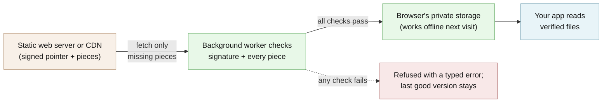

# Architecture

How `@edgeproc/browser` gets signed data into a browser tab, what it checks, what it
refuses, and what the tests prove. For the API itself, see [API.md](API.md). For setting up
the repo, see [GETTING_STARTED.md](GETTING_STARTED.md).

**[Explore the interactive architecture map](architecture/index.html)** (Archify, generated
from [`architecture/runtime.architecture.json`](architecture/runtime.architecture.json)).

## The short version

A publisher (the Python [`edge-proc`](https://github.com/hseshadr/edge-proc) CLI,
`edgeproc publish`) cuts your files into pieces ("chunks"), names each chunk by the SHA-256
of its contents, compresses it with zstd, and writes a manifest listing every file and its
chunks. It then signs one small "pointer" file, `latest`, that names the manifest. The result
is a folder of static files:

```text
origin/
  latest                 signed pointer: manifest hash, version, sequence, signature
  manifest/<sha256>      the file list, addressed by its own hash
  chunk/<sha256>         zstd-compressed pieces, addressed by the hash of their contents
```

Any static web server or CDN can serve that folder. Your page hands the folder's URL and the
public-key URL to a Web Worker (a background thread). The Worker:

1. fetches the public key (or keyring) with no HTTP caching, capped at 64 KiB;
2. fetches `latest` and checks its Ed25519 signature over canonical JSON bytes;
3. refuses the pointer if its `sequence` went backwards, or forked at the same sequence
   (rollback protection);
4. fetches the manifest and checks it against the hash the pointer named;
5. fetches only the chunks it does not already have, and checks each one against its hash
   after a size-bounded decompression;
6. only when everything passes, promotes the new version in browser storage. Any failure
   throws a typed error and the previous good version stays.

A small monitor inside the Worker reports every request the Worker made back to the page, so
"this page made no backend calls" can be counted instead of promised.



## Why this is harder than it looks

Two problems, both easy to get subtly wrong:

- **Checking the data.** Canonical bytes for the signature, a version counter that can only
  go up, decompression bombs, partial writes, and a crash halfway through an update. Every
  local-first app ends up rewriting this plumbing, and it is security-critical.
- **Counting the Worker's network use.** Every browsing context keeps its own
  resource-timing timeline. A `PerformanceObserver` on the window sees nothing a Worker
  fetches, so a "0 backend calls" counter built the obvious way reads zero exactly when it
  matters. This package installs the observer inside the Worker and posts its entries to the
  page over a `BroadcastChannel`, with epoch timestamps so they compare across contexts.

## Storage

Persistent storage writes new content to OPFS (the browser's private file system) and keeps
only the small active-pointer rollback floor in IndexedDB. When OPFS is missing, everything
goes to IndexedDB. Reads can reuse verified legacy content from either store without
duplicating it. Consumers with an existing cache can declare its database, object store and
key separator through `indexedDbLayout`. Names are bounded and validated.

Sync, read and clear share one cross-tab lock, so two tabs never write the same cache at once.

## Runtime dependencies

Three small runtime dependencies, each doing work that should not be hand-rolled:
`@noble/ed25519` (signatures), `@hpcc-js/wasm-zstd` (decompression) and `idb-keyval`
(IndexedDB). The opt-in `@edgeproc/browser/sqlite` and `@edgeproc/browser/vector/sqlite`
exports share one self-hosted SQLite 3.53.4 WASM build with the Apache-2.0 sqlite-vector
1.1.2 extension statically linked. See [dependencies.md](dependencies.md) and
[`src/vector/sqlite/assets/README.md`](../src/vector/sqlite/assets/README.md) for pins,
hashes and licenses.

## Security model

- **Checked:** the signed pointer (Ed25519, against a pinned public key or keyring fetched
  without HTTP caching), the file list it names, every chunk against its SHA-256 address,
  every decompressed size against its signed size, and every reassembled file.
- **Refused, never used with a warning:** a bad signature, a revoked or unknown signer, a
  tampered chunk, an oversized response, a rolled-back or forked pointer, or a pointer past
  its signed expiry. Each throws a typed error and nothing unchecked is returned. Only a
  genuine network outage may serve the cached copy.
- **Not protected:** a compromised page or browser extension (it runs with your page's
  rights), an attacker who controls the public-key URL itself (serve it over HTTPS, separately
  from the bundle), a stolen signing key before you revoke it, and what your app does with the
  data after it is checked.
- **Checking a release:** 0.1.0 on npm was a first bootstrap publish and carries no npm
  provenance (`npm view @edgeproc/browser@0.1.0 dist.attestations` is empty). Later releases
  publish from CI with provenance, which `npm audit signatures` checks. For an exact-Git-commit
  install, the build refuses if a clean rebuild of `dist/` differs from the committed output
  (`pnpm verify:dist`).

See [SECURITY.md](../SECURITY.md) for the full threat model, key rotation policy, and how to
report a vulnerability.

### Every refusal and its error

| Failure | Error |
|---|---|
| signature does not verify | `SignatureError` |
| pointer names a revoked / unlisted signer | `KeyRevokedError` / `UnknownKeyError` (both `SignatureError`) |
| trust root is malformed | `KeyringError` (an `IntegrityError`) |
| network pointer is past its signed `expires_at` | `PointerExpiredError` (an `IntegrityError`) |
| pointer has no non-negative `sequence` | `IntegrityError` |
| chunk hash does not match its content address | `IntegrityError` |
| decompressed size does not match the signed size | `IntegrityError` |
| response past its byte cap | `ResponseTooLargeError` (an `IntegrityError` on purpose, so sync never falls back to cache for it) |
| pointer sequence went backwards, or forked at equal sequence | `RollbackError` |
| bundle exceeds a structural cap | `SyncCapError` |
| Worker died before replying | `WorkerCrashError` |
| Worker went silent | `WorkerTimeoutError` |
| Worker operation failed | `EngineOperationError` with code `integrity`, `rollback`, `network`, `lock`, `storage`, or `internal` |

A network outage is the only condition that may serve cache, and it has its own type
(`NetworkError`) for exactly that reason. Through the Worker, every keyring and expiry
failure arrives as `EngineOperationError` with code `integrity`.

Chunk transport failures classified as `NetworkError` get six bounded retries with
exponential jitter (9 seconds maximum backoff). Integrity, signature, storage and rollback
failures are verdicts and are never retried.

## What the tests prove, and what they do not

| Claim | Evidence |
| --- | --- |
| A tampered chunk or wrong key is refused | `pnpm demo` step 4 (one bit flipped in the key gives `SignatureError`); the unit suite under `src/` |
| A second sync over a filled store downloads nothing | `pnpm demo` step 3 (`chunks fetched 0 (reused 783)`) |
| The built Worker enforces raw-key, keyring, and revoked-signer trust roots | `pnpm test:browser`, `test/browser/engine-keyring.spec.ts` in real Chromium |
| SQLite state and vectors persist in OPFS across restarts with zero external requests | `pnpm test:browser`, `test/browser/sqlite-vector.spec.ts` |
| The published `dist/` matches the source | `pnpm verify:dist` plus `test/dist-contract.test.ts`, both in `pnpm gate` |
| A Vite app emits exactly one engine Worker | `test/vite-consumer.test.ts` |
| The README's claims and links stay true | `test/readme.contract.test.ts` |

**Not proven here:** browsers other than Chromium (CI runs Chromium only), real OPFS locking
under jsdom (see below), and behavior on a compromised device.

### Known gaps in unit-test coverage

- **`opfsStore.ts` is excluded from the jsdom coverage numbers.** Its in-memory OPFS double
  covers dual-slot promotion, zero-byte cleanup, corruption recovery, and pre-write handle
  contention. Real sync-access-handle behavior is exercised in the Chromium tests.
- **`worker.ts` is excluded too**, because it is a top-level side effect: importing it under
  jsdom would run it, not test it. `test/browser/engine-keyring.spec.ts` drives the built
  Worker in real Chromium through the raw-key, keyring, and revoked-signer trust roots.
- **The SQLite Workers are excluded for the same reason.** Real Chromium opens OPFS, checks
  vector extension provenance and restart persistence, then exercises state export/import,
  cross-Worker visibility, a competing compare-and-swap write, reload persistence, and zero
  external requests.
- Coverage floors are enforced by `vitest.config.ts`: 90% lines, statements and functions,
  85% branches.

## What is deliberately not here

This package gets bytes into a tab intact and knows nothing about what they mean. Kept out on
purpose:

- **Ranking and recommendation.** The generic vector index lives here; product ranking
  lives in [edge-reco](https://github.com/hseshadr/edge-reco).
- **Sanctions screening and name matching.** That belongs to
  [aml-filter](https://github.com/hseshadr/aml-filter).
- **Wiring to your domain.** The code that connects this package to your app is yours, which
  keeps this a dependency rather than a framework.
- **Embedding models.** `@huggingface/transformers` is a heavy, model-specific dependency and
  does not belong in a package this low.

The rule: if a module needs to know what the bundle contains, it does not belong here.

## Where it came from

The signed-bundle engine was extracted from [edge-reco](https://github.com/hseshadr/edge-reco),
where it had already run in production. The package now also carries the consumer-independent
persistence, scoped sync, progress, typed errors, and packed-vector contracts. Domain catalog
selection and result shapes stay in the apps that use it, such as
[AlmaMesh](https://github.com/hseshadr/almamesh), which downloads its chart engine this way.
